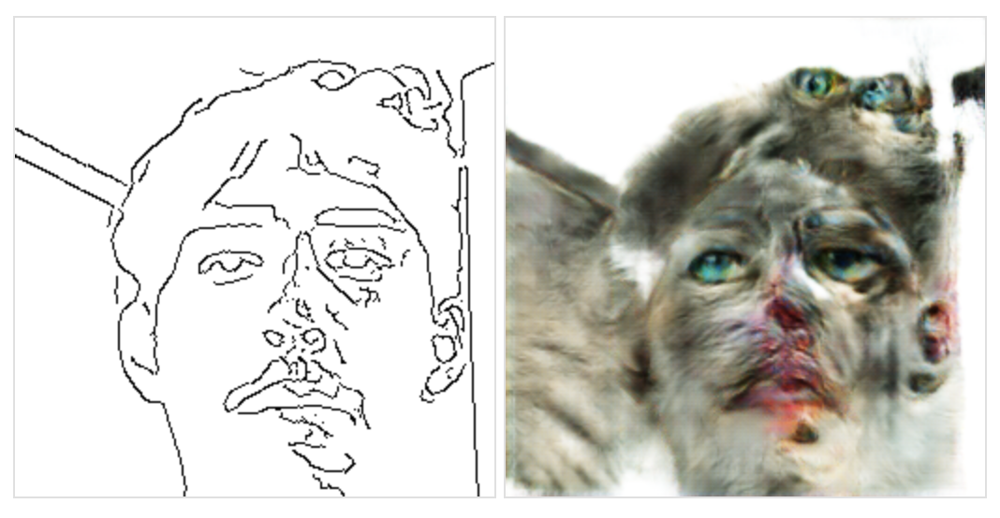
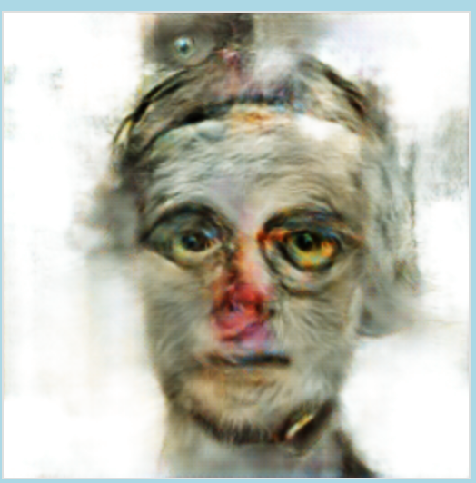
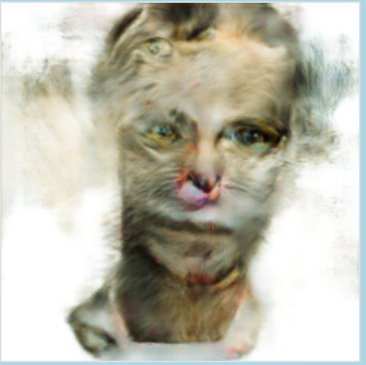
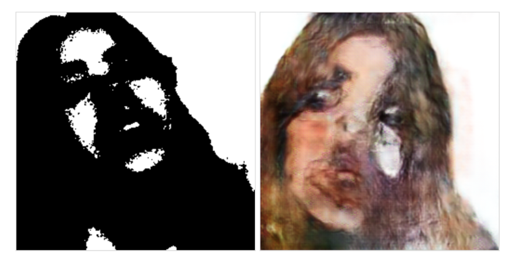
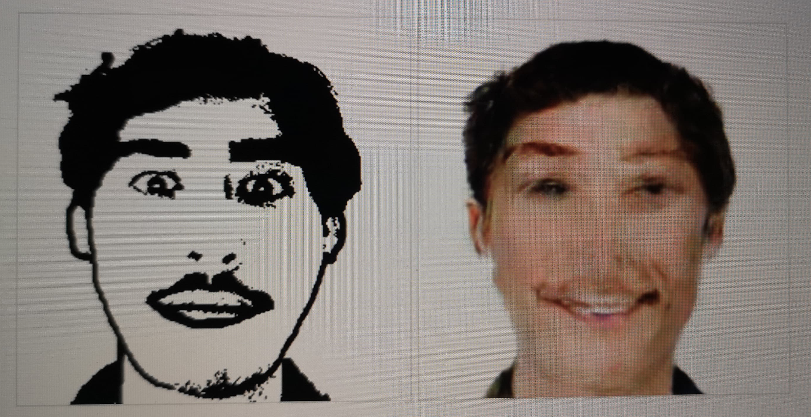

**A quick and stupid hobby-project I made for fun. Using Image-to-Image translation with conditional adversarial nets to transfer webcam-footage to cat-like images**
## Background
Back in 2017 Isola et al. published the paper "Image-to-Image Translation with Conditional Adversarial Nets" at the University of California, Berkeley. What followed were a series of implementations, some using Google's end-to-end open-source machine learning platform TensorFlow. Using a pre-trained model (edges2cats by Christopher Hesse) I tried to implement an interactive way of using your own face as the input. The following results were equally creepy as they were funny.
 
## Implementation
 
Firstly, I had to create the optimal input. By implementing an edge detection algorithm it was possible to transform the input webcam footage to clean black and white images. In short, by moving over groups of pixels, the code can detect any sharp changes in brightness values. This threshold fine-tuned depending on the video. After, I cropped the input to match the trained data size of 256x256 pixels.
 
## Tools
Due to this being a quick hobby project, I researched the fastest way to get started. I ended up using p5.js together with the high-level TensorFlow library ml5.js I was very impressed by how easy it was to throw everything together.
 
## Analysis
I'm aware that the model was not meant for human inputs, but I saw this project as a way of learning and exploring some basic machine-learning concepts. Depending on what one expected, the code still produces "usable" images. This is most likely because most mammals share a lot of common traits (two eyes, one nose, one mouth). This is why most often eyes are drawn in accordance with where the user's eyes are located. Still, most images were nightmare-inducing because they had a photorealistic quality to them, pushing them down the uncanny valley. Below are some of my favorite outputs and trials when using a model trained on human faces (note the black and white contrast filter instead of edge detection).

[person2cat (github)](https://github.com/MangoGott/webcam2pix)

[Try it here!](https://mangogott.github.io/NightmareCat/)

***

### Cat Output 1

### Cat Output 2

### Cat Output 2

### Face Output 1

### Face Output 2
