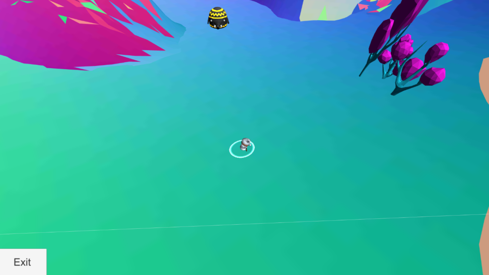

**A quick and stupid hobby-project I made for fun. Using Image-to-Image Translation with Conditional Adversarial Nets to transfer webcam-footage to cat-like images**
 
## Background
Hur det funkar...
Zephyrus takes place in a future where humanity has started colonizing the solar system. Humanities course was suddenly altered when reality shattered, and the laws of the universe changed. Cities with strange creatures appeared throughout the solar system and certain humans gained magical powers. With a new mysterious frontier, the player is set out to unc dover the secrets of this new reality.

The goal...was to bring the webcam-footage as close as possible to the training data input. Firt I attempted threshhold contrast blabla, then I finialy decided on edge detection. Kort om hur det funkar. 

The player grows their power by finding and collecting cards to build a deck of power spells to be used to overcome dangerous enemies. To compliment the players abilities, they can find and recruit characters to join their party. credd: (phillipi.github.io/pix2pix/)

## Analys
Even though I recieved "better" results after implementing edge detection (due to the image better matching the training data). blabla it works because we (as most mammals) share some common traits (two eyes, one nose, one mouth), apart from that 
fitting the input to that of the trained data. Edge detection was much closer. than a high contrst threshhold filter. blablabla. 
nightmare-ish images. link to models, and code I based this on. 
Below are some of my favorite outputs. 

[person2cat (github)](https://github.com/MangoGott/webcam2pix)
[Try it here!](https://github.com/MangoGott/webcam2pix)

***

### Output 1

### Output 2

### Output 3

### Output 4

