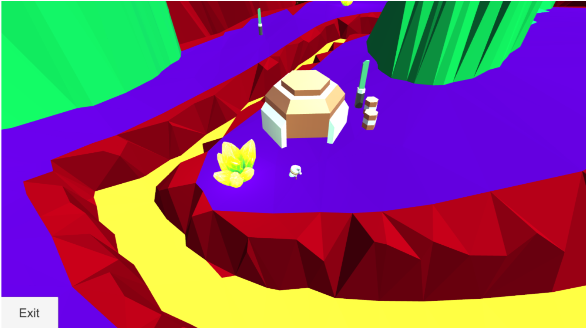
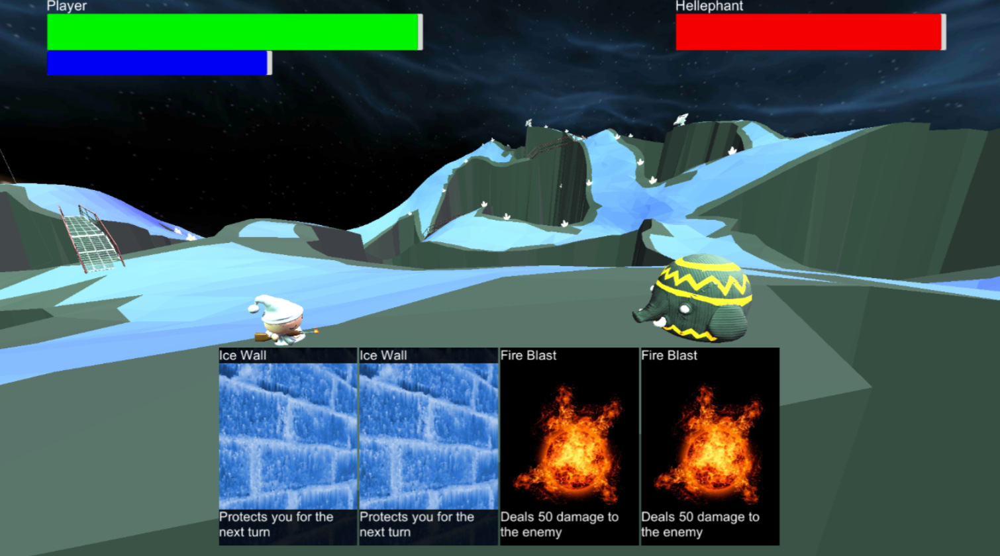
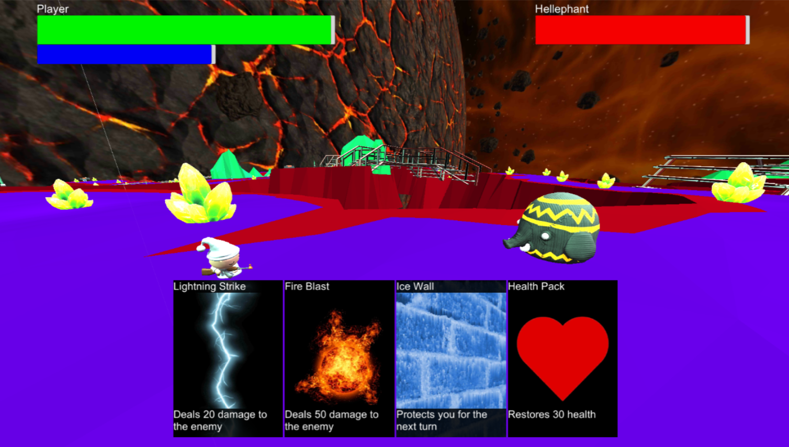

**Zephyrus is a mobile card-based role playing game. Set in a science fantasy themed world, the player explores the solar system recruiting party members and collecting cards to increase their power. This was a prototype developed during the game design course at KTH.**

## Game Concept
Zephyrus takes place in a future where humanity has started colonizing the solar system. Humanities course was suddenly altered when reality shattered, and the laws of the universe changed. Cities with strange creatures appeared throughout the solar system and certain humans gained magical powers. With a new mysterious frontier, the player is set out to uncover the secrets of this new reality.
The player grows their power by finding and collecting cards to build a deck of power spells to be used to overcome dangerous enemies. To compliment the players abilities, they can find and recruit characters to join their party.

## Tools
The game itself is developed in Unity since that’s what’s all of the group members felt most confident with and as version control, we used GitHub with some plugins in order to get large files (such as the environment) to be stored correctly and not generating any issues when pushing/pulling from the GitHub repository. As mentioned, we use XCode to compile the iOS version of the game and to compile. The Android version of the game is compiled directly in Unity using the Android SDK.

[Zephyrus - Game Design Document](https://drive.google.com/file/d/1Orajqyfkk6IUUirDK7YWkwRlU9X8F2R1/view?usp=sharing)

***

### Exploration 1

### Exploration 2

### Combat 1

### Combat 2

