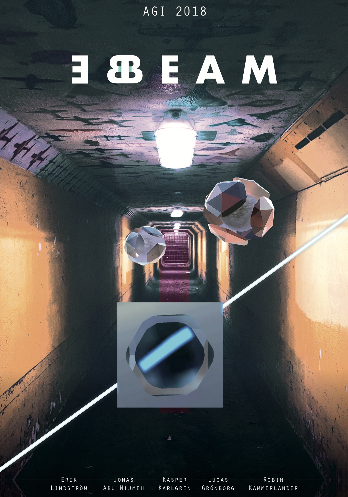

**beBeam is an AR (augmented reality) game where your objective is to lead a light beam to hit a target. You do this by placing mirrors and reflecting it in the real world.**

In today's industry, AR is mostly used only as a complement or a gimmick in applications. To oppose this thinking, we want to create a game experience that is built upon the possibilities AR allows instead of being a complement. To be able to navigate the game - the player has to interact and explore all three spacial dimentions.

The project aimed to produce an engaging AR experience with state of the art co-op and effective tracking. We want to explore how shadows and reflections can enhance the user’s spatial awareness to the virtual objects. Also how different post-processing methods can enhance the light beam and the overall experience.
We want to make interactions in AR as seamless as possible and give multimodal feedback. The latter to such a degree that it makes text and oral instructions redundant.

Visit the projectpage: [BeBeam](https://kasperii.github.io/beBeam/)

`vimeo: [beBeam] https://vimeo.com/298049909`

