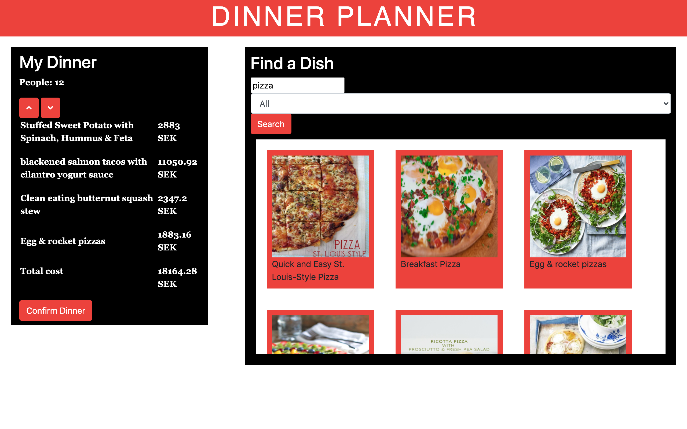

**A web app connected to a API where users could enter how many guests they were serving, then select different dishes and finally print out all the recipes together with the total cost.**

As practice, Dinner Planner was first constructed using vanilla ​HTML/CSS/Javascript. This was quite a challange and really made me appreciate the efficiency of using a framework. Afterwards, I made the same webapp using Vue.js. These projects were part of the course DH2642 Interaction Programming and the Dynamic Web

It was a great learning experience building this app, I got to implement everything in reference to the Model-View-Controller (MVC) design patter. In short, the web app is separated into three components. The Model holds all the data, the Controller receives input from the user and modifies the data accordingly, and the View presents the data. I also got to work with a API, making fetches, handling promises and timeouts, using fetched JSON-objects to generate content on the app, and much more. 

[Dinner Planner - Vue.js (Github)](https://github.com/MangoGott/DinnerPlanner_Vue.js)

[Dinner Planner - No Framework (Github)](https://github.com/MangoGott/DinnerPlanner_NoFramework)

***

