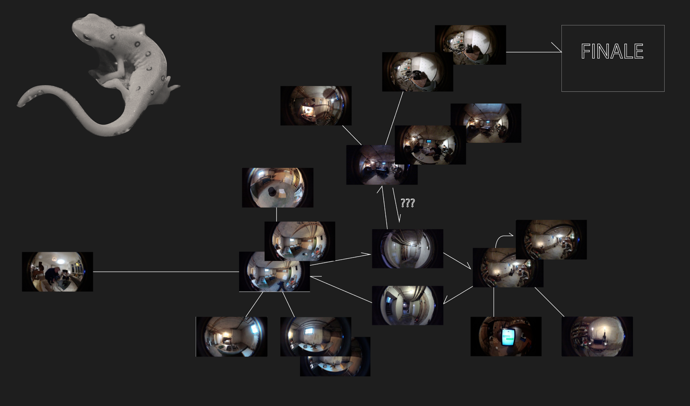
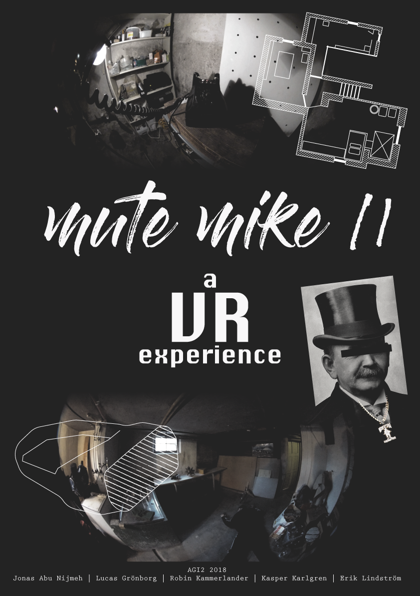

**Mute Mike is back! This time he has infiltrated a Stockholm based mob HQ. This game blends 270 degrees video footage, point and click interactions, escape room game play and humor into a new form of VR experience.**

Mute Mike II is a VR experience that lets you try out new technology while exploring a game genre from the past. The conceptual game is a project developed during the second half of the course AGI at KTH, Royal Intitute of Technology. In the game you play as Mute Mike, an ex-rapper, now infiltrator at the Stockholm PD. You have just infiltrated the mob when something goes wrong - someone has been murdered. Your task is to explore and find out who the killer is, while at the same time trying to escape the mansion. This game was produced with the help of VIC, the Visualisation Studio at KTH. The camera [back Bone with 220° lens] was lent to us from Raptor Vision, a company dedicated to working with VR camera experieces and live virtual productions.

By gazing towards different keypoints, the player can select where to go and what to interact with. We also developed a simpled nod and shake mechanic. When asked a yes or no-question by an actor, the player could either nod or shake their head. Which would have the story branch out depending on the selected action. 

This project has been a great opportunity for us as a team to explore how to create an immersive experience using very simple interactions and only movie clips. We happily declare the project as a success as most players really enjoyed the experience and the interaction was almost seamless.

[Mute Mike II Project Site](https://kasperii.github.io/mutemike/)

***

`vimeo: [beBeam] https://vimeo.com/306383908`

