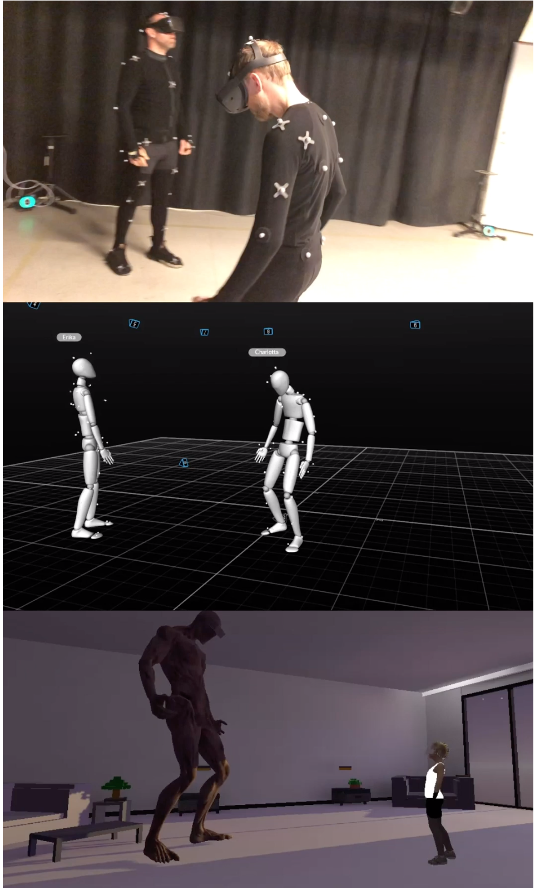

**By constructing a system utilizing virtual reality (VR) headsets in combination with motion capture technology, the goal was to bring both the environments and characters into the live performance.**

Motion capture systems are becoming more common within the entertainment industry, used for capturing actor’s movements and performances for animation purposes. However, the empty setting in which these performances take place differ a lot from traditional acting scenarios usually comprised of detailed sets, costumes and props.

The main challenges actors face is the mental work required to visualize an environment or characters that is not physically there. Furthermore, without proper reference it is difficult to find the right natural movements for one’s differently proportioned character, as well as acting towards such a character.

The evaluation was conducted by letting two actors at a time perform a scene in both the traditional setup and the VR setup. It was decided to measure their over all sense of embodiment as many of the underlying elements align with immersive qualities. This includes measuring their sense of presence, agency, and their connection to their character but also their acting partner’s character. Qualitative data was gathered through postperformance interviews and a questionnaire where participants rated different statements related to the sense of embodiment using a 5-point Likert scale.

The final results implies that the VR system improves some aspects associated with embodiment in comparison to the traditional setup. This in turn changed the way the participants performed the scenes. The majority stated that they had an easier time of portraying their characters when in VR. From the interviews conducted it seemed that the participants had a easier time playing towards the environment, as well as towards their acting partner, due to them being able to play off and react to things they could actually observe.

Read the paper: [Master's Thesis](https://kth.diva-portal.org/smash/get/diva2:1467053/FULLTEXT01.pdf)

